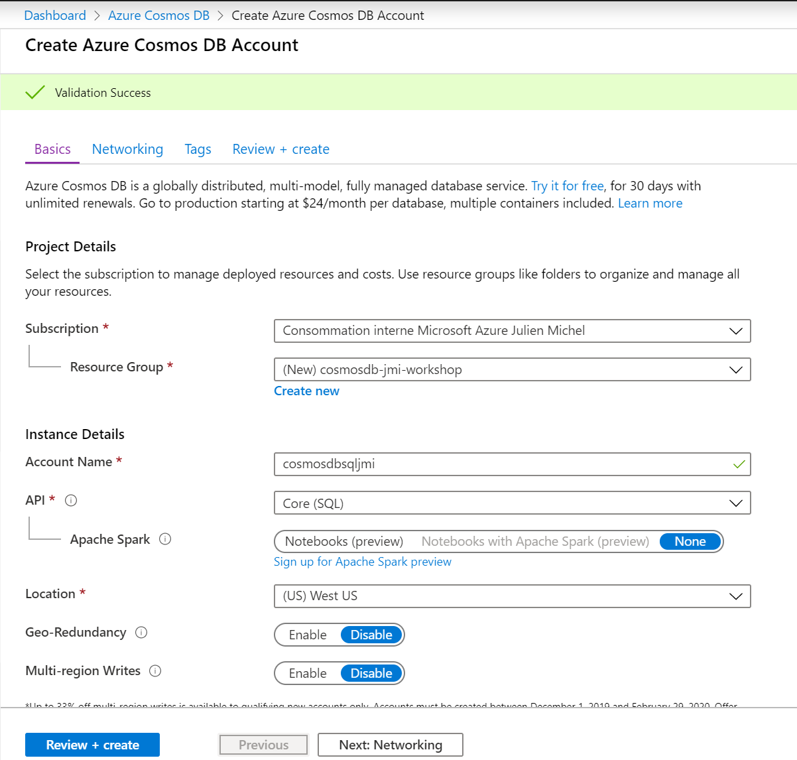
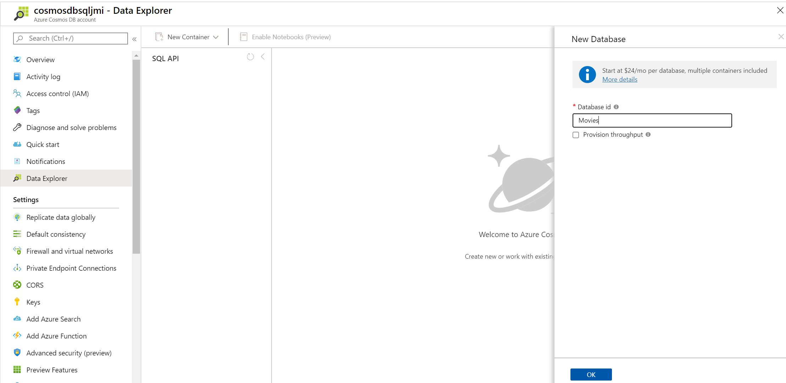
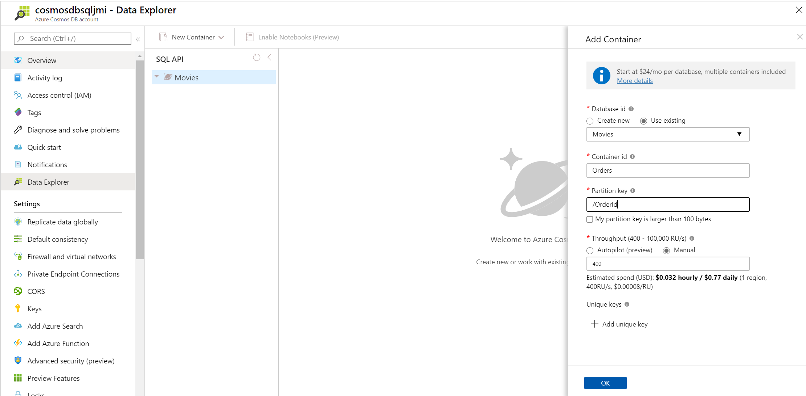

# To the cloud
Attendees provision a new Cosmos DB account, using the SQL API, located in a resource group.
1. In the Azure Portal, navigate to Azure Cosmos DB and click on "Add" button.  
  
2. Provision a new Cosmos DB account, using the SQL API, located in a new resource group.  
      
  
      
  
3. When the account is created, navigate to the Data Explorer and create a new Database. Uncheck the "Provision throughput" option.  
    
  
4. Have a look to the SQL Database schema to create containers (with default throughput : 400 RUs) according to the existing tables:
    - Orders
    - OrderDetails
    - Category
    - User
    - Events
    - Item
    - ItemAggregate
    - CartItem  
      
    
  >**Tips**:  
  >     The creation of containers can be achieved thanks to the Azure CLI tool accessible from the portal. An example of commande that can be used :  
  >     **az cosmosdb sql container create -a cosmosdbsqljmi -g cosmosdb-jmi-workshop -d Movies -n Item -p '/ItemId' --throughput 400**  
  
5. Now we need to upload data from the existing SQL Server database, go to Lab 2
