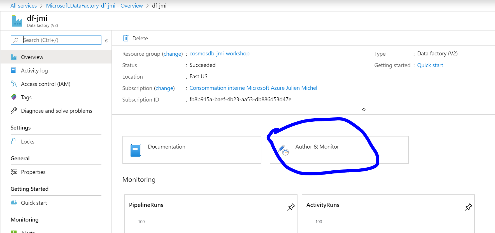
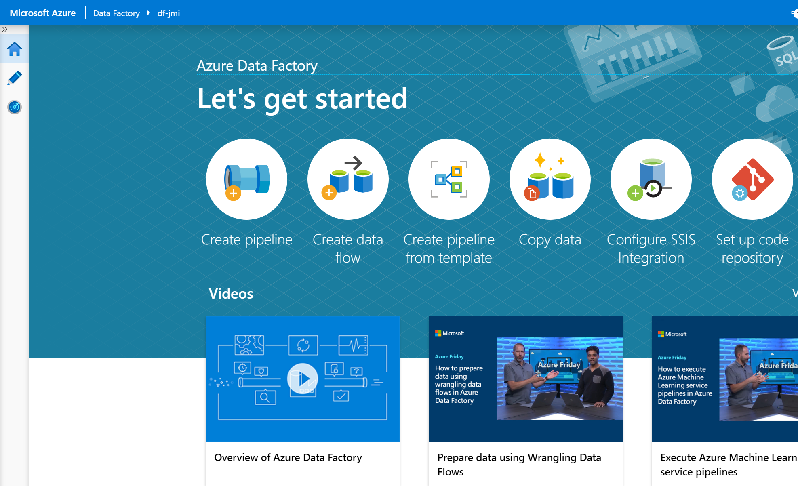

# Migrate the data

## Context
Now that the team has provisioned a new database, Contoso Video wants to start migrating their data. They hope that all the data can be migrated without loss, but are not sure how it should be restructured, if at all, to work within the new data store. Contoso informed the team that their website performs satisfactorily in general, but once a customer selects an item to get more detailed information, the page often loads slowly for customers during peak hours. This drives some to become frustrated and to shop on other websites instead.  
Contoso is hoping that by migrating their data to the new cloud database, they can independently scale up throughput for product browsing to alleviate these long wait times without affecting the cost or performance of their checkout functionality.  
  
## Tasks  
The preferred migration tool to Cosmos DB is Azure Data Factory (ADF), given its ability to perform migrations at scale, along with transformations and orchestration using several actions, if needed.  
In this lab, we would like to guide you in the usage of ADF to migrate the data from the existing SQL database to your Cosmos DB account.
This step will be the creation of an ADF pipeline to copy data from SQL to Cosmosdb, with no transformation, 1 table = 1 collection.

1. From the Azure portal, got to Data Factories and create a new instance by clicking the **"Add"** button.  
  
2. Give it a name, select the resource group you created in the previous lab, a region and unchecked the **"enable GIT"** option.  
  
3. When the deployment if finished, open the new Data Factory instance and click on Author & Monitor  
    
  
4. In the ADF Editor homepage, click on the Copy Data activity
    
  
5. Define a name, then define the source with SQL Database, the destination with the newly created Cosmos DB account
  - To define the source, select new connection in the Azure tab, then select SQL Managed Instance and set the connection string
  - Select the tables to copy and go next
  - To define the destination, selection new connection in the Azure tab, then select Azure Cosmos DB (SQL API) and set the connection string
  - Start the configuration of the mapping between tables.
  - When everything is done, validate until the deployment page and execute the copy pipeline  
    
6. ...  
  
7. Next step is the optimisation of the data model. Go to 

>## Tips:
>   Within the transformation steps, a good practice would be to add a new derived field that sets the entity type so different entities within the same container can be identified by type, for querying purposes. Attendees will perform optimizations in the next challenge, so don't expect full denormalization and ideal partition strategies at this point. The main goal is for attendees to perform a repeatable raw migration to their NoSQL database.

## Resources
  •	
